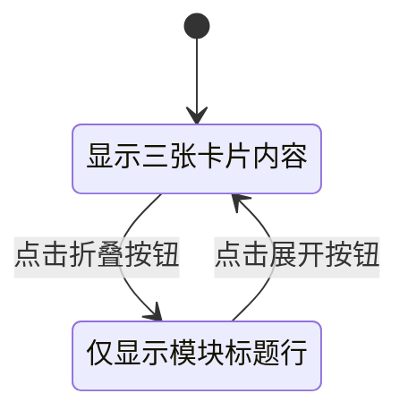
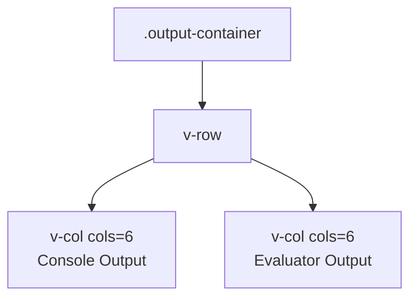
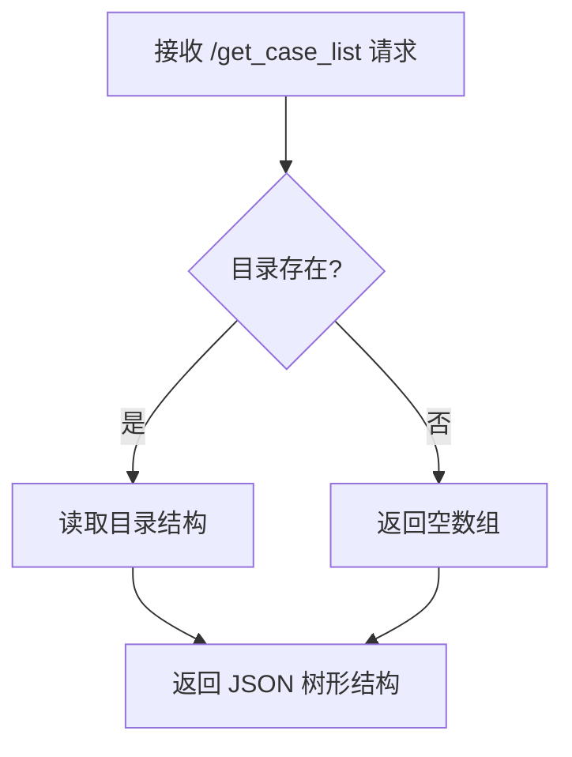
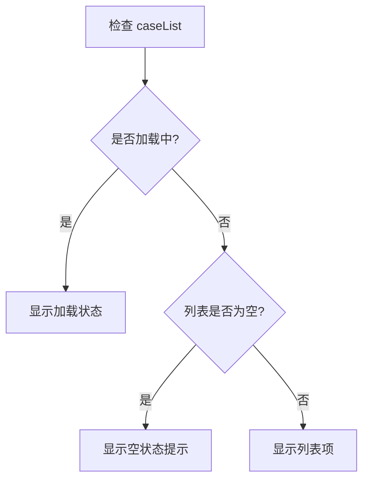
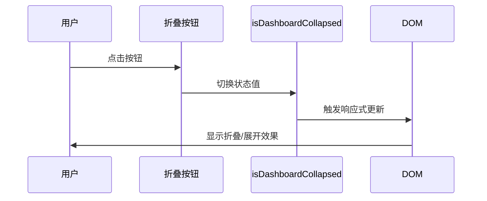
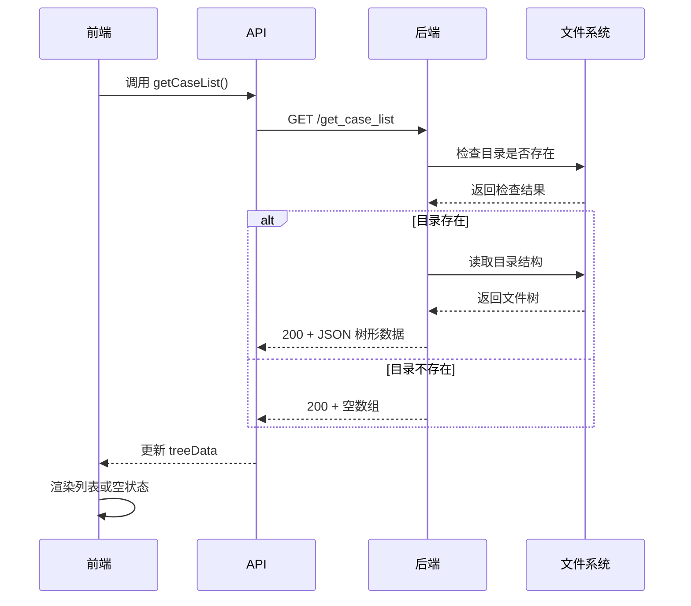

# 页面布局优化设计文档

## 1. 设计目标

优化 VTK.js 评估器系统主页面的视觉布局和交互体验，重点解决以下核心问题：

- 减少仪表盘（Dashboard）占用的垂直空间
- 扩大代码展示和预览区域的可视宽度
- 统一输出区域的横向宽度
- 修复后端接口缺失导致的数据加载错误
- 改善空列表状态的用户体验

## 2. 需求分析

### 2.1 布局空间问题

**当前状况**：
- 顶部区域（`.head`）高度为 8vh，显示完整标题
- 仪表盘区域（`.dashboard`）始终展开，包含三张卡片（查询拓展、检索结果、评估分数）
- 左侧代码预览区（`.left`）与右侧配置区（`.right`）的 flex 比例为 10:2
- 底部输出组件（控制台和评估器）宽度未与上方预览区对齐

**用户痛点**：
- 仪表盘在生成代码后自动展开，挤占大量代码预览空间
- 代码展示区域过窄，影响代码可读性
- 输出区域宽度不一致，视觉体验不统一

### 2.2 数据加载问题

**当前状况**：
- 前端调用 `/get_case_list` 接口返回 404 错误
- `app.py` 中使用 `DATA_DIR` 变量但未定义（第 372、398 行）
- 目录依赖路径 `data/vtkjs-examples/benchmark` 可能不存在
- 前端 `config/index.vue` 组件在列表为空时无提示信息

**影响范围**：
- 用户无法浏览已有案例库
- 空状态缺少友好提示，体验不佳

### 2.3 标题显示优化

**当前状况**：
- 顶部标题显示为 "Vtkjs Evaluator"
- 标题行高度占用过多空间

**需求**：
- 标题更名为 "Rawsiv"
- 压缩标题行高度至仅显示一行小标题

## 3. 设计方案

### 3.1 仪表盘折叠机制

#### 3.1.1 功能设计

引入仪表盘折叠/展开控件，通过切换状态释放垂直空间。

**交互流程**：

#### 3.1.2 组件结构设计

**仪表盘组件层级**：

| 元素 | 展开状态 | 折叠状态 |
|------|---------|---------|
| 折叠按钮 | 显示向上箭头图标 | 显示向下箭头图标 |
| 三张卡片容器 | 完整显示 | 隐藏（v-show=false） |
| 标题行 | 显示 | 显示（包含三个模块名称） |

**状态管理**：

| 状态变量 | 类型 | 初始值 | 说明 |
|---------|------|--------|------|
| isDashboardCollapsed | Boolean | false | 控制仪表盘折叠状态 |

**视觉规则**：

- 折叠状态下仪表盘高度不超过 60px
- 展开时保持动画过渡效果（transition 300ms）
- 折叠按钮固定在仪表盘右上角

#### 3.1.3 样式策略

**CSS 控制规则**：

| 类名 | 属性 | 展开值 | 折叠值 |
|------|------|--------|--------|
| .dashboard | max-height | auto | 60px |
| .dashboard | overflow | visible | hidden |
| .dashboard | transition | all 0.3s ease | all 0.3s ease |
| .dashboard-content | display | block | none |

### 3.2 布局比例调整

#### 3.2.1 横向空间分配

**调整策略**：

| 区域 | 当前 flex 值 | 优化后 flex 值 | 变化说明 |
|------|------------|--------------|---------|
| .left（代码预览区） | 10 | 16 | 增加 60% 宽度 |
| .right（配置区） | 2 | 1 | 减少 50% 宽度 |

**计算依据**：

- 总 flex 比例从 12 调整为 17
- 左侧占比从 83.3% 提升至 94.1%
- 右侧配置区最小宽度设为 200px，确保按钮可见性

#### 3.2.2 垂直空间优化

**顶部区域调整**：

| 元素 | 当前高度 | 优化后高度 | 说明 |
|------|---------|-----------|------|
| .head | 8vh | 4vh | 压缩至仅显示标题行 |
| .dashboard（折叠时） | 动态 | 最大 60px | 约 4vh |
| .dashboard（展开时） | 动态 | 保持当前 | 无变化 |

**可视化显示与隐藏按钮重新定位**：

- 将 `.setting` 中的 `v-switch` 控件移至 `.right` 侧边栏顶部
- 避免占用独立行空间

### 3.3 输出区域宽度统一

#### 3.3.1 对齐原则

确保底部输出组件（Output Component）的宽度与上方代码预览区（`.preview`）保持一致。

**约束规则**：

| 组件 | 宽度控制策略 |
|------|------------|
| .output | 设置 width: 100% |
| .output-container | 继承父容器宽度 |
| Output 内部两列（控制台/评估器） | 各占 50%（cols="6"） |

#### 3.3.2 内部布局优化

**Output 组件内部结构**：

**样式调整**：

- 移除 Output 组件中的额外 padding
- 确保 `.console-container` 和 `.markdown-container` 最大高度一致（max-height: 300px）
- 保持两侧边距对称

### 3.4 后端接口修复

#### 3.4.1 DATA_DIR 变量定义

**问题根源**：
- `app.py` 第 372、398 行使用未定义的 `DATA_DIR` 全局变量
- `/get_case_list` 接口依赖 `data/vtkjs-examples/benchmark` 目录

**解决方案**：

在 `app.py` 文件顶部导入语句后添加变量定义：

| 变量名 | 值 | 类型 | 说明 |
|--------|---|------|------|
| DATA_DIR | `os.path.join('data', 'vtkjs-examples')` | 字符串路径 | 数据集根目录 |

**添加位置**：第 20 行后（`from datetime import datetime` 之后）

#### 3.4.2 目录存在性检查

**路径验证逻辑**：

**增强措施**：

在 `/get_case_list` 接口中添加目录检查逻辑：

| 条件 | 返回结果 | HTTP 状态码 |
|------|---------|-----------|
| 目录存在且可读 | 树形结构 JSON | 200 |
| 目录不存在 | 空数组 `[]` | 200 |
| 读取权限错误 | 错误信息 | 500 |

### 3.5 空状态优化

#### 3.5.1 列表空状态提示

**当前问题**：
- `config/index.vue` 中 `caseList` 为空时无提示
- 用户不清楚是否正在加载或数据不存在

**设计方案**：

在 `config/index.vue` 的列表容器中添加条件渲染：

| 状态 | 显示内容 | 视觉元素 |
|------|---------|---------|
| 加载中 | 加载提示 | 旋转图标 + "加载中..." |
| 空数据 | 空状态提示 | 空图标 + "暂无案例数据" |
| 有数据 | 列表项 | 原有的 v-list-item |

**实现策略**：

#### 3.5.2 空状态视觉规范

**设计参数**：

| 属性 | 值 | 说明 |
|------|---|------|
| 图标 | `mdi-folder-open-outline` | Vuetify 图标 |
| 图标大小 | 48px | |
| 图标颜色 | `grey-lighten-1` | |
| 文字颜色 | `#9e9e9e` | |
| 文字大小 | 14px | |
| 容器最小高度 | 150px | |
| 对齐方式 | flex center | 垂直水平居中 |

### 3.6 标题更名

**修改内容**：

| 位置 | 当前值 | 新值 |
|------|-------|------|
| home.vue setup() return | `'Vtkjs Evaluator'` | `'Rawsiv'` |

## 4. 实现优先级

基于影响范围和修改难度，建议按以下顺序实施：

| 优先级 | 任务 | 影响范围 | 估计工作量 |
|-------|------|---------|-----------|
| P0 | 修复 DATA_DIR 变量定义 | 后端接口可用性 | 5 分钟 |
| P0 | 目录存在性检查 | 接口健壮性 | 10 分钟 |
| P1 | 顶部标题更名和高度压缩 | 视觉优化 | 5 分钟 |
| P1 | 仪表盘折叠功能 | 垂直空间利用 | 30 分钟 |
| P2 | 左右区域 flex 比例调整 | 横向空间优化 | 10 分钟 |
| P2 | 输出区域宽度统一 | 视觉一致性 | 15 分钟 |
| P3 | 空列表状态提示 | 用户体验 | 15 分钟 |

## 5. 技术约束

### 5.1 前端技术栈

- Vue 3 Composition API
- Vuetify 3 组件库
- 响应式设计原则

### 5.2 后端技术栈

- Flask 框架
- 文件系统操作
- JSON 数据格式

### 5.3 兼容性要求

- 支持现代浏览器（Chrome、Edge、Firefox）
- 响应式布局适配不同屏幕尺寸
- 不破坏现有功能逻辑

## 6. 数据流设计

### 6.1 仪表盘状态管理

**状态变更流程**：

### 6.2 案例列表加载流程

**数据获取流程**：

## 7. 视觉设计规范

### 7.1 折叠按钮样式

| 属性 | 展开状态 | 折叠状态 |
|------|---------|---------|
| 图标 | `mdi-chevron-up` | `mdi-chevron-down` |
| 位置 | 仪表盘右上角（absolute） | 仪表盘右上角（absolute） |
| 背景色 | 半透明白色 rgba(255,255,255,0.7) | 半透明白色 rgba(255,255,255,0.7) |
| 圆角 | 4px | 4px |
| 尺寸 | small | small |

### 7.2 动画过渡效果

| 元素 | 过渡属性 | 持续时间 | 缓动函数 |
|------|---------|---------|---------|
| .dashboard | max-height, overflow | 300ms | ease-in-out |
| 折叠按钮图标 | transform | 200ms | ease |

### 7.3 响应式断点

| 屏幕宽度 | 布局调整 |
|---------|---------|
| < 768px | 仪表盘卡片垂直堆叠（cols=12） |
| >= 768px | 仪表盘卡片横向排列（cols=4） |
| >= 1200px | 保持当前布局 |

## 8. 验收标准

### 8.1 功能验收

| 功能点 | 验收标准 |
|--------|---------|
| 仪表盘折叠 | 点击按钮可切换状态，折叠后高度不超过 60px |
| 代码预览区宽度 | 左侧区域宽度占比提升至约 94% |
| 输出区域对齐 | 控制台和评估器输出宽度与上方预览区一致 |
| 接口修复 | `/get_case_list` 返回 200 状态码，不再出现 404 |
| 空状态提示 | 列表为空时显示友好提示信息 |
| 标题更名 | 顶部显示 "Rawsiv" |

### 8.2 性能验收

| 指标 | 要求 |
|------|------|
| 折叠动画流畅度 | 60fps |
| 布局调整后首次渲染 | 无明显闪烁 |
| 数据加载响应时间 | < 1s（正常网络环境） |

### 8.3 兼容性验收

| 浏览器 | 版本要求 | 测试项 |
|--------|---------|--------|
| Chrome | >= 90 | 所有功能正常 |
| Firefox | >= 88 | 所有功能正常 |
| Edge | >= 90 | 所有功能正常 |

## 9. 风险评估

### 9.1 技术风险

| 风险项 | 影响程度 | 缓解措施 |
|--------|---------|---------|
| 折叠动画性能问题 | 低 | 使用 CSS transform 代替高度动画 |
| flex 比例调整导致布局错乱 | 中 | 多屏幕尺寸测试验证 |
| 后端目录不存在导致崩溃 | 低 | 添加异常处理和默认值 |

### 9.2 用户体验风险

| 风险项 | 影响程度 | 缓解措施 |
|--------|---------|---------|
| 仪表盘折叠后用户找不到数据 | 中 | 默认展开状态，折叠按钮明显可见 |
| 右侧配置区过窄导致按钮换行 | 低 | 设置最小宽度 200px |

## 10. 后续优化建议

### 10.1 可访问性增强

- 为折叠按钮添加 ARIA 属性（aria-expanded）
- 键盘快捷键支持（如 Ctrl+D 切换仪表盘）

### 10.2 用户偏好持久化

- 将仪表盘折叠状态保存至 localStorage
- 页面刷新后恢复用户上次的布局偏好

### 10.3 高级布局模式

- 提供全屏代码编辑模式
- 支持拖拽调整左右分栏宽度
