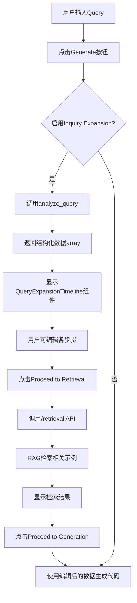

# Query Expansion Workflow - 完整流程指南

## 📋 概述

本指南详细说明了查询拓展可视化、编辑和分步检索生成的完整工作流程。

## 🎯 核心功能

### 1. **提示词拓展可视化**
- 使用垂直时间轴/步骤条展示拓展后的提示词
- 每个步骤包含：
  - Phase（阶段标识）
  - Step Name（步骤名称）
  - VTK Modules（使用的VTK模块列表）
  - Description（详细描述）

### 2. **交互式编辑**
- 每个步骤都可独立编辑
- 点击编辑按钮进入编辑模式
- 失焦后自动保存到前端状态
- 支持修改步骤名称、模块列表和描述

### 3. **分步工作流程**
- **第一步**：生成并显示提示词拓展结果
- **第二步**：点击"Proceed to Retrieval"按钮，使用编辑后的数据执行检索
- **第三步**：检索完成后，点击"Proceed to Generation"按钮执行代码生成

## 🏗️ 架构设计



## 📁 文件修改清单

### 后端修改

#### 1. `app.py`
- **修改内容**：
  - 修改 `/generate` 端点，返回结构化的 `analysis_data`（array）而不是纯文本
  - 新增 `/retrieval` 端点，接收编辑后的拓展数据，执行RAG检索
  - 使用 `RAGAgent(use_v3=True)` 启用 retriever_v3

- **关键代码**：
```python
# 保存结构化的分析数据供前端使用
if isinstance(analysis, list):
    analysis_data = analysis  # 直接保存结构化数据
else:
    analysis_data = []

# 返回结构化数据
data_dict['analysis'] = analysis_data

# 新增检索端点
@app.route('/retrieval', methods=["POST"])
def handle_retrieval():
    analysis = obj.get('analysis', [])
    prompt = obj.get('prompt', '')
    rag_agent = RAGAgent(use_v3=True)
    final_prompt = rag_agent.search(analysis, prompt)
    retrieval_results = rag_agent.get_retrieval_metadata()
    return jsonify({
        'success': True,
        'final_prompt': final_prompt,
        'retrieval_results': retrieval_results
    })
```

### 前端修改

#### 2. `QueryExpansionTimeline.vue`（新增）
- **位置**：`front/src/components/dashboard/QueryExpansionTimeline.vue`
- **功能**：
  - 垂直时间轴展示拓展步骤
  - 每个步骤卡片支持编辑
  - Phase 彩色标签和图标
  - VTK Modules 芯片列表
  - "Proceed to Retrieval" 按钮

- **Props**：
```javascript
props: {
  content: {
    type: [String, Array],  // 支持JSON字符串或数组
    default: () => []
  }
}
```

- **Emits**：
```javascript
emits: ['update:content', 'next-step']
```

#### 3. `LeftSidebar.vue`
- **修改内容**：
  - 替换 `QueryExpansionCard` 为 `QueryExpansionTimeline`
  - 添加工作流状态管理（idle, expanded, retrieved, generated）
  - 新增 `handleExpansionUpdate`、`handleProceedToRetrieval`、`handleProceedToGeneration` 方法
  - 添加状态指示器芯片
  - 检索结果展示后才显示"Proceed to Generation"按钮

- **关键状态**：
```javascript
const workflowState = ref('idle');  // 工作流状态
const queryExpansionData = ref([]); // 拓展数据
const updatedExpansionData = ref(null); // 用户编辑后的数据
```

- **工作流逻辑**：
```javascript
// 监听拓展数据变化，自动切换到 retrieval 模式
watch(() => props.queryExpansion, (newVal) => {
  if (Array.isArray(newVal) && newVal.length > 0) {
    workflowState.value = 'expanded';
    sidebarMode.value = 'retrieval';
  }
});

// 处理"进入检索"按钮
const handleProceedToRetrieval = async (expansionData) => {
  const response = await axios.post('/retrieval', {
    analysis: expansionData,
    prompt: newCase.value.prompt
  });
  context.emit('retrieval-complete', response.data.retrieval_results);
  workflowState.value = 'retrieved';
};

// 处理"进入生成"按钮
const handleProceedToGeneration = () => {
  const finalExpansionData = updatedExpansionData.value || queryExpansionData.value;
  newCase.value.expansionData = finalExpansionData;
  handleUpload();  // 调用原有生成逻辑
};
```

#### 4. `home.vue`
- **修改内容**：
  - 更新 `handleSeGenEnd` 处理结构化的 analysis 数据
  - 新增 `handleRetrievalComplete` 处理检索完成事件
  - 添加 `@retrieval-complete` 事件监听

- **关键代码**：
```javascript
// 处理结构化的拓展数据
if (Array.isArray(res.analysis)) {
  currentCase.queryExpansion = res.analysis;
} else if (typeof res.analysis === 'string') {
  try {
    currentCase.queryExpansion = JSON.parse(res.analysis);
  } catch (e) {
    currentCase.queryExpansion = [];
  }
}

// 处理检索完成
const handleRetrievalComplete = (retrievalResults) => {
  currentCase.retrievalResults = retrievalResults;
};
```

## 🔄 数据流转

### 完整数据流

```
1. 用户输入 Query
   ↓
2. 后端 analyze_query() 返回结构化数据
   [{
     phase: "Data Loading",
     step_name: "Load VTI file",
     vtk_modules: ["vtkXMLImageDataReader", "vtkImageData"],
     description: "..."
   }, ...]
   ↓
3. 前端接收并显示在 QueryExpansionTimeline
   - 垂直时间轴展示
   - 每个步骤可编辑
   ↓
4. 用户编辑（可选）
   - 修改 step_name
   - 添加/删除 vtk_modules
   - 修改 description
   - 失焦自动保存到 updatedExpansionData
   ↓
5. 点击 "Proceed to Retrieval"
   - 发送编辑后的数据到 /retrieval
   - 后端执行 RAG 检索
   - 返回 retrieval_results
   ↓
6. 显示检索结果
   - RetrievalResultsCard 展示
   - 显示 "Proceed to Generation" 按钮
   ↓
7. 点击 "Proceed to Generation"
   - 使用最终的拓展数据调用生成 API
   - 执行代码生成
```

### API 数据格式

#### `/generate` 端点响应
```json
{
  "generated_code": "...",
  "final_prompt": "...",
  "analysis": [
    {
      "phase": "Data Loading",
      "step_name": "Load VTI file",
      "vtk_modules": ["vtkXMLImageDataReader"],
      "description": "Load the volumetric data..."
    }
  ],
  "retrieval_results": [...]
}
```

#### `/retrieval` 端点请求/响应
```json
// 请求
{
  "analysis": [...],  // 编辑后的拓展数据
  "prompt": "..."     // 原始用户查询
}

// 响应
{
  "success": true,
  "final_prompt": "...",
  "retrieval_results": [
    {
      "id": "...",
      "title": "...",
      "description": "...",
      "relevance": 0.95,
      "matched_keywords": [...]
    }
  ]
}
```

## 🎨 UI/UX 特性

### QueryExpansionTimeline 组件

#### 视觉设计
- **时间轴指示器**：渐变色圆圈（紫色系）+ 连接线
- **步骤卡片**：悬浮效果，编辑时高亮蓝色边框
- **Phase 标签**：彩色芯片，根据阶段自动配色
  - Data Loading → Blue
  - Data Processing → Green
  - Visualization → Orange
  - Rendering → Purple
  - Interaction → Teal

#### 交互设计
- 卡片悬浮时显示编辑按钮
- 编辑模式：显示保存/取消按钮
- VTK Modules 使用 Combobox 支持添加/删除
- 失焦自动保存（emit `update:content`）

#### 空状态
```html
<div class="empty-state">
  <v-icon size="48" color="grey-lighten-1">mdi-timeline-text-outline</v-icon>
  <p>No query expansion data available</p>
</div>
```

### 工作流状态指示器

显示在 Retrieval 面板顶部：

| State | Color | Text |
|-------|-------|------|
| idle | grey | Ready |
| expanded | success | Query Expanded - Ready for Retrieval |
| retrieved | primary | Retrieved - Ready for Generation |
| generated | info | Code Generated |

## 🧪 测试流程

### 手动测试步骤

1. **启动应用**
```bash
# 后端
python app.py

# 前端
cd front
npm run dev
```

2. **测试提示词拓展**
   - 勾选 "Inquiry Expansion"
   - 输入查询："Generate volume rendering with VTI file"
   - 点击 Generate
   - 验证：自动切换到 Retrieval 面板，显示时间轴

3. **测试编辑功能**
   - 点击任意步骤的编辑按钮
   - 修改 step_name
   - 添加一个新的 VTK Module
   - 修改 description
   - 点击保存按钮
   - 验证：编辑内容已保存

4. **测试检索流程**
   - 点击 "Proceed to Retrieval" 按钮
   - 验证：显示加载提示
   - 验证：检索完成后显示结果卡片
   - 验证：显示 "Proceed to Generation" 按钮

5. **测试生成流程**
   - 点击 "Proceed to Generation" 按钮
   - 验证：使用编辑后的数据生成代码
   - 验证：代码正确生成并显示

### API 测试

使用 Postman 或 curl 测试：

```bash
# 测试检索端点
curl -X POST http://localhost:5000/retrieval \
  -H "Content-Type: application/json" \
  -d '{
    "analysis": [
      {
        "phase": "Data Loading",
        "step_name": "Load VTI",
        "vtk_modules": ["vtkXMLImageDataReader"],
        "description": "Load volumetric data"
      }
    ],
    "prompt": "Generate volume rendering"
  }'
```

## 🐛 常见问题

### Q1: 拓展数据没有显示在时间轴中
**原因**：后端返回的数据格式不正确
**解决**：
- 检查 `app.py` 是否返回 `analysis_data` 而不是 `analysis_text`
- 检查 `analyze_query()` 是否返回 list[dict]
- 在浏览器控制台检查 `res.analysis` 的值

### Q2: 编辑后的数据没有用于检索
**原因**：`updatedExpansionData` 没有正确更新
**解决**：
- 检查 `handleExpansionUpdate` 是否正确触发
- 在 `handleProceedToRetrieval` 中打印 `expansionData` 确认数据

### Q3: 检索端点返回 500 错误
**原因**：RAG Agent 初始化失败或数据格式错误
**解决**：
- 检查后端日志
- 确认 MongoDB 和 FAISS 索引可用
- 检查传递给 `rag_agent.search()` 的参数格式

### Q4: 时间轴样式显示异常
**原因**：CSS 冲突或 Vuetify 版本问题
**解决**：
- 检查 `.step-circle` 和 `.step-line` 的样式
- 确认 Vuetify 组件版本兼容

## 📚 下一步优化

### 功能增强
- [ ] 支持拖拽调整步骤顺序
- [ ] 支持添加/删除步骤
- [ ] 支持一键重置到原始拓展结果
- [ ] 支持保存常用的拓展模板
- [ ] 支持批量编辑多个步骤

### 性能优化
- [ ] 检索结果缓存
- [ ] 防抖优化编辑保存
- [ ] 虚拟滚动优化大量步骤展示

### UI/UX 改进
- [ ] 添加步骤间的关系线（依赖关系）
- [ ] 支持折叠/展开长描述
- [ ] 添加拓展结果的导出功能（JSON/Markdown）
- [ ] 添加撤销/重做功能

## 🎓 总结

本次修改实现了一个完整的三步工作流：

1. **提示词拓展** → 结构化可视化 + 可编辑
2. **检索** → 基于编辑后的数据进行 RAG 检索
3. **生成** → 使用最终数据生成代码

核心优势：
- ✅ 用户可见提示词拓展的详细结构
- ✅ 用户可编辑每个步骤以优化检索
- ✅ 分步骤控制，增强可控性
- ✅ 数据流清晰，易于调试和扩展

技术亮点：
- 🎨 美观的时间轴 UI 设计
- 🔄 完整的状态管理（idle → expanded → retrieved → generated）
- 📡 独立的检索 API 端点
- 🛠️ 灵活的编辑机制
