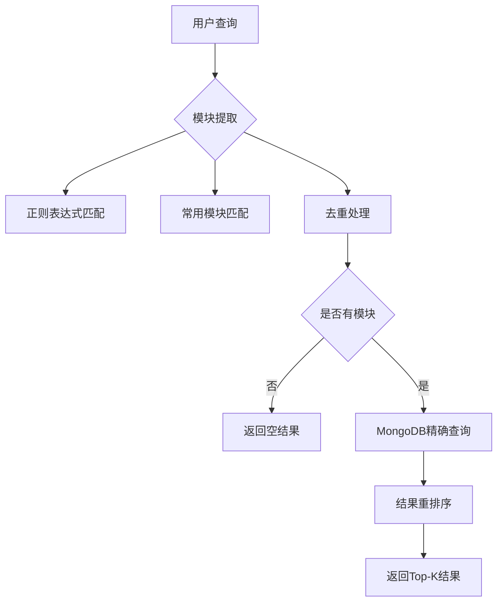

# embedding_v4.py 功能说明文档

> **注意**：本文档介绍的向量数据库方案已废弃，是旧版本方案

## 1. 概述

`embedding_v4.py` 是 NL2Vis 项目中 RAG 检索模块的一个重要组件，它实现了基于关键词匹配的检索方案，用于替代原有的基于语义相似度的检索方案。该模块专门针对 VTK.js 可视化代码的检索进行了优化，能够从扩展后的提示词中准确提取 VTK.js 相关模块信息，并据此进行高效的代码片段检索。

## 2. 设计目标

- **简化检索流程**：摒弃复杂的语义向量计算，采用更直观的关键词匹配方式
- **提高检索效率**：通过直接数据库查询替代向量检索，显著提升检索速度
- **保持接口兼容性**：维持与原有模块相同的函数接口，确保系统无缝切换
- **专注 VTK.js 领域**：专门针对 VTK.js 模块进行优化的检索逻辑

## 3. 核心功能

### 3.1 VTK.js 模块提取

模块能够从用户的自然语言查询中准确识别和提取 VTK.js 模块名称，包括：
- 完整路径格式：如 `vtk.Rendering.Core.vtkActor`
- 简写格式：如 `vtkActor`
- 常用模块简写：通过 `app_config.VTKJS_COMMON_APIS` 配置的常用模块

### 3.2 关键词检索机制

采用基于 MongoDB 的精确匹配检索，通过 `$in` 操作符直接查找包含指定模块的代码片段，跳过了传统的 FAISS 向量检索过程。

### 3.3 结果重排序

虽然不使用语义相似度，但仍提供结果重排序功能，根据以下因素计算相关性得分：
- 模块在文档描述中的匹配情况
- 模块在文档 vtkjs_modules 列表中的匹配情况

### 3.4 接口兼容性

保持与原有检索模块一致的函数接口，包括：
- `search_code_optimized`
- `search_code_optimized_with_stages`
- `search_code_with_topk_analysis`

## 4. 主要组件

### 4.1 MongoDBManager 类

负责与 MongoDB 数据库交互，提供基于模块列表的文档查找功能。

关键方法：
- `find_docs_by_modules(modules)`: 根据模块列表查找包含任意一个模块的文档

### 4.2 查询分析函数

#### analyze_query(query)
从用户查询中提取 VTK.js 模块信息：
1. 使用正则表达式匹配多种格式的 VTK.js 模块名称
2. 匹配常用模块简写形式
3. 去重处理，确保模块列表唯一性

### 4.3 结果重排序函数

#### rerank_results(raw_results, analyzed_query)
对检索结果进行重排序：
1. 计算每个文档与查询的相关性得分
2. 得分基于模块在描述和模块列表中的匹配情况
3. 按得分降序排列结果

评分机制：
- `WEIGHT_MODULE_MATCH_IN_DESCRIPTION = 1.0`：描述匹配权重
- `WEIGHT_MODULE_PARTIAL_MATCH_IN_VTKJSM = 2.0`：模块列表匹配权重

### 4.4 核心检索接口

#### search_code_optimized(query, k, similarity_threshold=None, recall_k_multiplier=5)
新版检索接口的主要入口：
1. 解析查询提取 VTK 模块关键词
2. 直接查询 MongoDB 进行精确匹配
3. 对结果进行重排序
4. 返回前 K 个最相关结果

## 5. 工作流程

## 6. 配置参数

- `WEIGHT_BASE_SIMILARITY = 0.0`：基础相似度权重（已废弃）
- `WEIGHT_MODULE_MATCH_IN_DESCRIPTION = 1.0`：描述匹配权重
- `WEIGHT_MODULE_PARTIAL_MATCH_IN_VTKJSM = 2.0`：模块列表匹配权重
- 数据库连接配置：`DB_HOST`, `DB_PORT`, `DB_NAME`, `COLLECTION_NAME`

## 7. 性能优势

1. **检索速度**：跳过向量计算和 FAISS 检索，直接数据库查询，显著提升检索速度
2. **资源消耗**：无需加载和维护向量索引，降低内存和存储开销
3. **准确性**：对于明确包含模块信息的查询，关键词匹配可能比语义相似度更准确

## 8. 使用场景

适用于以下场景：
- 用户查询中明确提及 VTK.js 模块名称
- 需要快速检索相关代码示例
- 对检索速度要求较高但对语义理解要求相对较低的场景

## 9. 注意事项

1. 该模块完全依赖关键词匹配，对于语义上相关但不包含具体模块名称的查询效果有限
2. 需要确保 MongoDB 中的文档正确标注了 `vtkjs_modules` 字段
3. 权重参数可根据实际效果进行调整优化